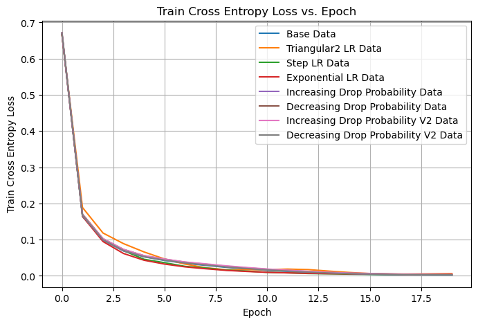
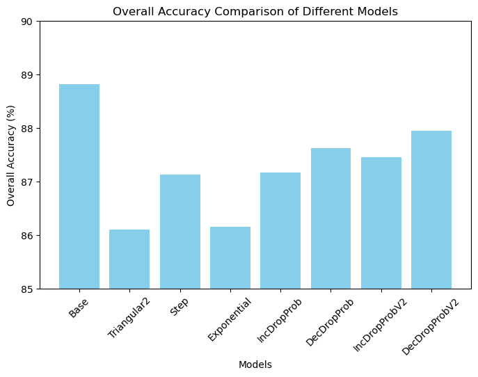
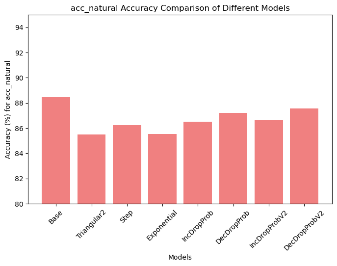
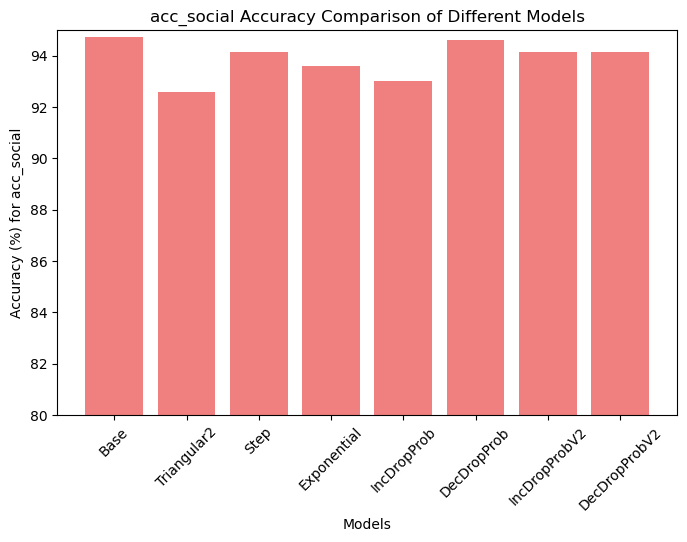
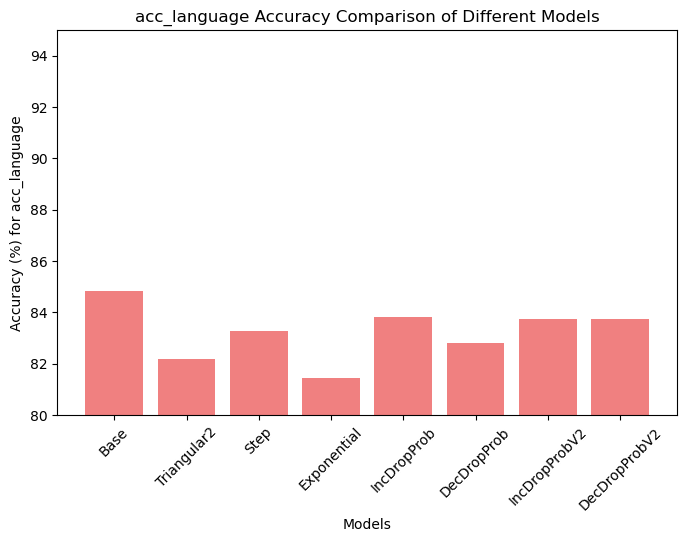
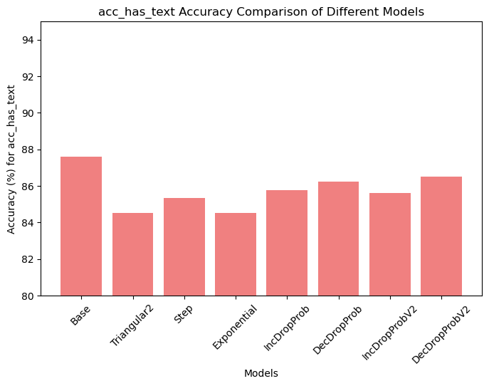
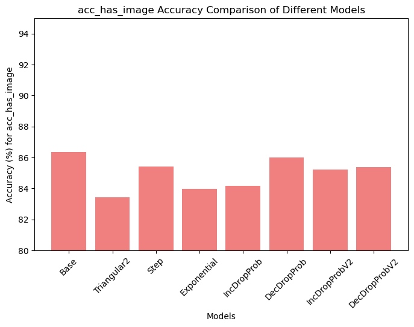
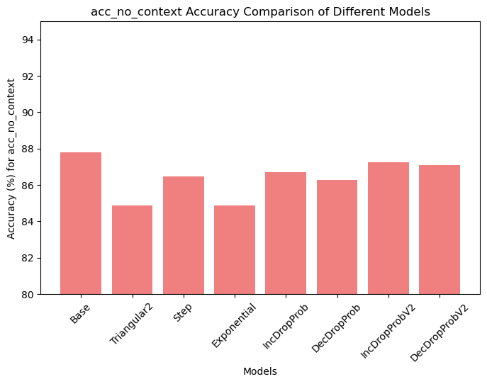
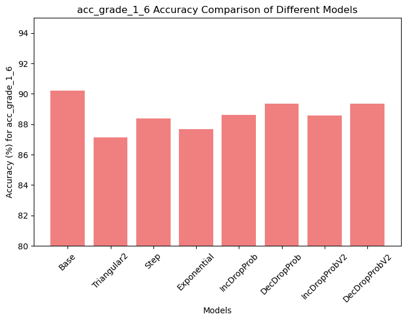
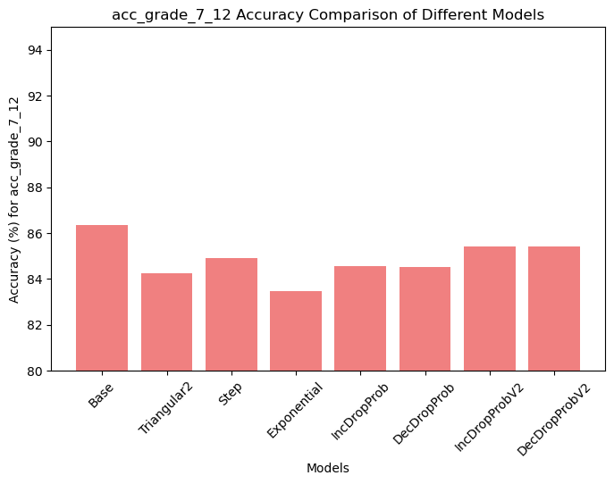

# Title
project description


## Project Milestones
- [x] Train (original) LaVIN 7B and validate accuracy
- [x] Train LaVIN 7B using Cyclical Learning Rate and validate accuracy
- [x] Train LaVIN 7B using Step Decay (Learning Rate) and validate accuracy
- [x] Train LaVIN 7B using Exponential Decay (Learning Rate) and validate accuracy
- [x] Train LaVIN 7B having the dropout probability (in the MMA adapter) increase after each layer
- [x] Train LaVIN 7B having the dropout probability (in the MMA adapter) decrease after each layer
- [x] Elaborate comparative graphs
- [x] Validate each "modification" using a live chatbot (on text questions and images)


## Downloads
- Install LaVIN from [official repo](https://github.com/luogen1996/LaVIN)
- Download ScienceQA dataset from [official repo](https://github.com/lupantech/ScienceQA)
- Download [LLaMA-7B](https://huggingface.co/nyanko7/LLaMA-7B/tree/main) from HuggingFace


## Repository and Code Structure
```bash
LaVIN/
  |-- lavin
  |-- scripts
  |-- train.py
  |-- eval.py
  ......
data/
  |-- problem.json
  |-- pid_splits.json
  |-- captions.json
  |-- images
      |-- train          # ScienceQA train image
      |-- val            # ScienceQA val image
      |-- test           # ScienceQA test image
  |-- weights
      |-- tokenizer.model
      |--7B
          |-- params.json
          |-- consolidated.00.pth
```


## Commands to Execute the Code
To run the project:
```bash
bash ./scripts/finetuning_sqa_7b.sh
```

which contains:
```bash
CUDA_VISIBLE_DEVICES=0,1,2,3 torchrun --nproc_per_node 4 --master_port 11111 train.py \
    --llm_model 7B\
    --llama_model_path ../data/weights/ \
    --data_path ../data/alpaca_data.json \
    --max_seq_len 512 \
    --batch_size 2 \
    --accum_iter 4 \
    --epochs 20 \
    --warmup_epochs 2 \
    --blr 9e-3 \
    --weight_decay 0.02 \
    --output_dir ./LaVIN-7B/\
    --adapter_type attn\
    --adapter_dim 8\
    --adapter_scale 1\
    --n_prompt 6 \
    --prompt_format QCM-ALE \
    --temperature 10.\
    --visual_adapter_type router

CUDA_VISIBLE_DEVICES=3 torchrun --nproc_per_node 1 --master_port 11111 eval.py \
    --ckpt_dir ../data/weights/ \
    --llm_model 7B\
    --tokenizer_path ../data/weights/tokenizer.model \
    --data_root ../data \
    --caption_file ../data/captions.json \
    --adapter_path ./LaVIN-7B/checkpoint-19.pth \
    --adapter_type attn \
    --adapter_dim 8 \
    --adapter_scale 1 \
    --prompt_format QCM-ALE \
    --max_batch_size 64\
    --max_seq_len 512 \
    --split test \
    --n_prompt 6 \
    --temperature 10.\
    --visual_adapter_type router
```


## Results












## Demo


## References
1) https://github.com/luogen1996/LaVIN
2) https://github.com/lupantech/ScienceQA
3) https://huggingface.co/nyanko7/LLaMA-7B/tree/main
4) 

